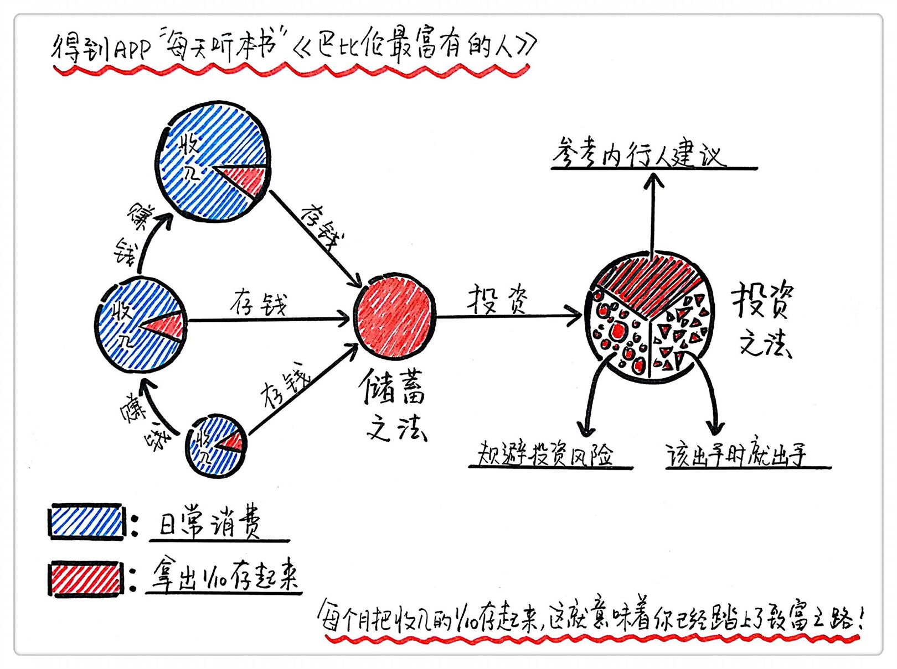

## 读《巴比伦最富有的人》总结  

关于作者  

乔治·S·克拉森是美国著名理财大师，堪称现代理财教育的先驱。从1926年起，克拉森出版了一系列发行量极大的理财小册子，很快成为数百万人耳熟能详的著作。
关于本书  

《巴比伦最富有的人》是克拉森理财著作中最有名的一本，书中讲述了巴比伦几位超级大富翁的成功之道。虽然是一本半个多世纪前诞生的小书，却被翻译成多种文字，至今行销不衰。

核心内容  

关于理财，你只需要知道两件事——如何储蓄，如何投资。  

  

一、把收入的十分之一存起来  

如果你愿意把收入的十分之一存起来，那么就已经踏上了致富之路。不要担心生活质量，因为不要把必要开销和欲望混为一谈。  

【案例1】阿尔卡德的发家之路  

在放债人奥加米什的指导下，穷困潦倒的抄写员阿尔卡德开始坚持有规律地攒钱，也就是每次拿到报酬，他都取出其中十分之一的铜币存起来，而生活习惯的改变，使得阿尔卡德发现这并不影响花销。通过积少成多，阿尔卡德最终找到了生财之道，并赢得了奥加米什的信任和垂青，最后阿尔卡德幸运地接管了奥加米什的巨大产业。他之所以成功，就是因为他并不是从一些困难又不切实际的任务开始，而是选择自己能力范围之内的事情去坚持，从容地一步步前进。  

二、投资要合理谨慎，不要不顾风险，一味追求高利润   
投资一定不能盲目，要在保证资金安全的前提下才可以进行，要投资在能得到预期回报的项目上，利润合理就行，总之要避免不切实际的投资。  

【案例】阿尔卡德的教训  

阿尔卡德在存了一年的钱之后，想用钱生钱，通过一个经常出海的砖匠在提尔港帮来一些上等宝石，等回来时高价卖掉，结果毫无鉴别力的砖匠为人所骗，买了一堆分文不值的玻璃块回来。奥吉米什告诫他，从一个毫无理财经验的人那里学习理财知识，必定一败涂地，血本无归。阿尔卡德从失败中汲取教训，当重新有了积蓄再次投资时，他找到资金短缺的制盾人，请他用来购买青铜，制盾人每四个月会付给阿尔卡德一笔利息作为回报，阿尔卡德由此开始了他的投资理财之路。  

三、投资活动中，行动力同样重要，面对好机会要当机立断  

凡事没有绝对，投资时不要轻易冒险，但并不是说任何时候都要左思右想，犹犹豫豫。要想通过投资赚到更多的钱，既要谨慎，又要果断，当好机会到时来，一定不能错过。机会有时会在某一个晚上不期而至，第一个判断往往都是最好的判断，而很多时候正是我们的犹豫不决，导致痛失良机。  

【案例】牲畜商人错失良机  

一名贩卖牲畜的中年人，在返回巴比伦的途中，因为天色已晚城门已经关闭，只好和奴隶们一起在城外搭帐篷过夜。一个同样也被锁在城外的农夫过来找牲畜商人，要把一群刚刚赶来的绵羊卖给他，理由是妻子突然得了重病，他必须尽快赶回去照顾。牲畜商人心动了，觉得农夫开价也很合理，但由于黑夜里没法数清，坚持要到天亮点清羊群数目后才愿意付钱。结果第二天早上，四个商人急匆匆出城跟农夫购买羊群，原来城市遭受敌军围困，食物短缺，他们开出了比牲畜商人所出价格高三倍的数字，农夫当然毫不犹豫把羊群卖给了城里的商人。牲畜商人眼看着大赚一笔的机会，就这样跟自己擦肩而过。  

> 金句：  

1. 财富就像一棵树，它从一颗种子萌芽。你存下的第一个铜币就是种子，它能长成一棵财富的参天大树。你越快播下那颗种子，财富之树就会越快开始生长。你持续不断地储蓄，越虔诚地为这棵财富之树浇水施肥，你就能越快地享受到它的荫庇。  

2. 渔夫长年累月坚持摸索鱼的习性，依靠风向的变化来决定撒网的方向，那不叫运气。机会是一个骄傲的女神，她绝不会眷顾那些毫无准备的人。  

3. 一个人拥有的财富并不是以他已经装到袋子里的钱币来衡量的，而是他创造的那些收入，那些持续流入他的钱袋并使钱袋一直饱满的黄金之河才是他的财富。  

4. 有决心，就能找到出路。
