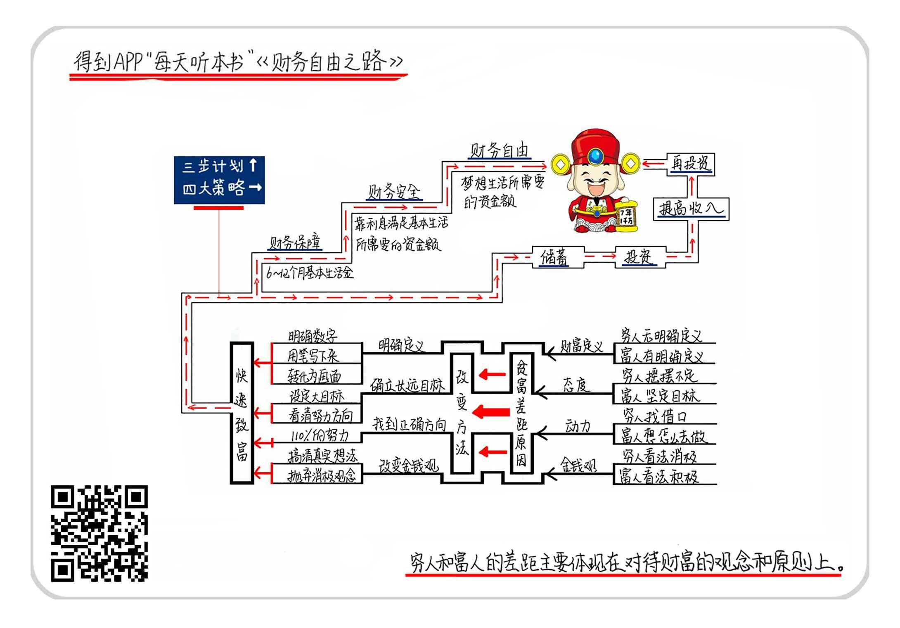

## 读《财务自由之路》总结   

关于作者  

博多·舍费尔，德国理财大师。1960年出生于德国科隆，16岁独自闯荡美国，26岁时不幸陷入了财务危机，债台高筑，但4年后，他不仅摆脱了危机，还创办了数家公司，通过投资成为欧洲知名的亿万富翁。此后，博多·舍费尔开始向大众传播自己的致富秘诀和理财知识，他希望更多的人能够通过这些方法获得财务自由，过上幸福的生活。除了《财务自由之路》外，另著有畅销书《赢家法则》和《小狗钱钱》。  

关于本书  

本书是理财入门书籍，投资理财或财商教育的必读书之一。在德国出版后，曾一度成为德国图书年度畅销榜的   NO.1，连续110周占据在德国图书排行榜榜首的位置。这本书还被翻译成了33种语言，在全球畅销，销量超过一千万册，改变了很多人的理财观念。  

核心内容  

拥有财富是人们与生俱来的权利，但是要消除对金钱的偏见，不要当一台赚钱机器，而要拥有一台自动为你赚钱的机器。只要转变理财观念，掌握投资理财的方法，任何人都能实现财务自由，成为金钱的主人，不再为金钱而烦恼，过梦想的生活，拥有成功和幸福的人生。  

  

一、关于财务自由  

所谓财务自由，就是指你不需要仅仅为了应付生活支出而工作，靠资产产生的利息就可以维持基本的生活开支。换言之，你不再是一台赚钱机器，而是拥有一台为你赚钱的机器。拥有财务自由，是我们拥有自由人生的基础。  

二、穷人和富人的差距  

穷人和富人的差距，主要体现在对待财富的信念和原则上，具体表现为四方面：  
- 对于财富的定义不同、  
- 对待财富和财富目标的态度不同、  
- 赚钱的动力不同、  
- 金钱观不同。  

1. 财富的定义
穷人对财富没有明确的定义，富人对财富则有着非常明确的定义，比如在多少年内要赚到多少钱。作者提到，要定义财富，需要满足三个条件：必须知道明确的数字、一定要用笔把它写下来、要把它转化为相应的画面。  

2. 对待财富和财富目标的态度
穷人从来没觉得自己一定要有钱，财富目标也总是摇摆不定，换来换去，而富人则认为，我必须要有钱，没有其他的选择，因为我无法再忍受穷困潦倒的日子，更不希望自己这辈子就这样了。作者认为，要制定大目标，这样一来，出现问题时，看向目标的视线就不会被挡住，你就会更清楚自己的努力方向。  

3. 赚钱的动力
穷人赚钱的动力不足，借口多，只关注自己的劣势，而且不打算付出110%的努力，富人却有着很足的赚钱动力，关注自己的优势，并全力以赴。  

4. 金钱观
穷人普遍对金钱有偏见，看法消极，而富人的金钱观比较积极。  

三、实现财务自由的三步计划和四个策略  

实现财务自由的三步计划是逐步递增的，分别是实现财务保障、财务安全和财务自由，这几个阶段性财务目标分别对应着不同的金钱数目。  

1. 财务保障  
就是指能保证你6-12个月内基本生活的储备金。也就是说，假设你生病了、失业了或是遇到了种种难以预料的麻烦，导致你目前无法工作，这笔钱能够支撑你度过这段时间或是顺利找到下一份工作。这笔钱主要用于应对不时之需，所以一定不能随意动用，也不可用于任何有风险的投资。  

2. 财务安全  
是指你需要积累足够的资金，以保证你可以靠利息满足基本的生活需要。假设年利率为8%，你每个月至少需要支出3000块，那3000*150=45万，就是你要达到财务安全所需要的资金总额。为了保证资产安全，这部分资金的投资依然要以稳健为主。  

3. 财务自由  
是指资产的利息收入等于或大于你的生活支出。你可以详细列出你所梦想中的生活所需要的金钱数额，平均到每个月中，再用这个数目乘以150，就是你要达到财务自由所需要的资金总额。假设年利率仍然为8%，你每个月至少需要支出10000块，那就是10000*150=150万。当然，其中最重要的一条原则是，无论出于任何原因，都绝对不要动用你的本金，即能给你下蛋的“金鹅”。  

实现财务自由的四大策略：按一定的比例储蓄金钱、用这些储蓄资金投资、想办法增加收入、从每次加薪中提取一定比例的金钱进行储蓄。简言之，就是存钱、投资、开源、再存钱再投资。  

1. 储蓄一定比例的金钱  
使人变富有的，不是收入而是储蓄，储蓄是最基本也最简单的理财方式。就连全球投资之父、史上最成功的基金经理约翰·邓普顿也非常重视储蓄。他在非常年轻的时候，就和妻子共同决定，把每个月收入的50%存下来，即使是在挣得特别少的月份也坚持做到这一点。股神巴菲特早在当报童时，就将自己省下的每一美元都存起来，因为他更关心自己在未来的财富。巴菲特透露，变得富有的秘诀很简单，就是：储蓄，投资；继续储蓄，继续投资。  

2. 投资  
只靠存钱是无法让我们在短时间内变得富有的，而且我们的最终目的是为了实现财务自由，能够更自由、灵活地运用金钱，所以，有了一定的资产后，就用投资所得去消费，而不是一味地压制自己的消费，把自己变成一个守财奴。
要进行投资，我们就要先搞清楚投资和债务的区别。区分它们的关键在于：金钱是在流向你还是远离你。如果金钱流向你，那就是投资；反之，就是债务。比如汽车就属于负债，这是因为汽车从刚买入的那一刻起就开始贬值了，而且它需要停车费、汽油费、洗车费、保养费等等，钱不断地从你的身边流走了。  

3. 增加收入  
增加收入的方式有很多，作者的建议是找出你的天赋和热情所在，给自己订一个目标——3年后成为你所在领域的专家，然后朝着这一目标努力。
有一个绝佳的技巧：假设现在就是3年后，你已经成了所在领域的专家，你可以给写一个广告宣传自己，向大家介绍你的产品或是能提供的服务。这样做，可以让你就从客户的角度出发，考虑到自己的优势所在，同时也能意识到如何最大化地满足客户的需求。在写广告的过程中，你或许就能确定自己到底喜不喜欢这一领域，如果真的不喜欢，就可以尽早转行，选择别的领域。与此同时，你也可以寻找其他的收入来源，逐步将你主要的精力都集中在收入丰厚的工作上，逐渐减少收入低又耗时的工作。  

4. 把增加的那部分收入按照一定的比例存起来  
如果你的欲望不高，依旧保持原有的支出水平，除了拿出一些钱购物奖励自己，就可以把增加的所有收入都存起来，然后拿这笔钱再进行投资。在具备了相应的投资知识之后，投资得越早越好，因为复利的魔力大得惊人，而影响复利的两大因素就是时间和利润率。而且，要实现财务自由，最好遵循“一半一半”的投资原则，也就是一半用于中风险投资，一半用于高风险投资，多学习，多实践，或者拜成功者为师，进行投资。  

> 金句  

1. 穷人总是更加关注“为什么”，而不是“怎么做”。  

2. 我们对于金钱的潜意识看法会出卖我们，有些想法可能连我们自己都没有意识到，嘴上说着不要不要，身体却很诚实。如果你对金钱的看法非常消极，在内心深处认定有钱并不是一件好事，那就很难变得有钱。  

3. 你所饲养的“金鹅”越多，它们下得金蛋就越多，也就是说，你能用于投资的资金总额越大，越能尽快地实现财务自由，这样的话，或许根本用不了7年的时间，你就能实现财务自由。  

4. 7年之后，希望我们都能拥有持续赚钱的能力，实现财务自由，让自己和家人过上梦想中舒适、有尊严的生活，不再为金钱所困，让金钱为我们服务，掌控自己的人生。
