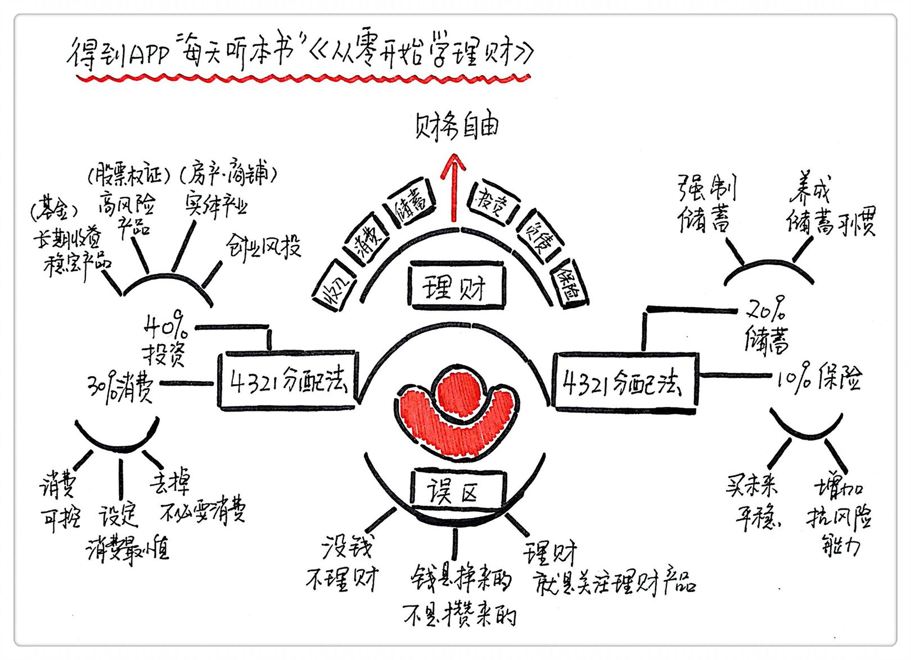

## 读《从零开始学理财》总结  

关于作者：  

张鹤，著名的财经作家和理财专家，撰写《成功理财的16堂课》《银行投资理财赚钱法》等理财类的畅销书。  

关于本书：  

是一本理财的工具书，主要包括理财的基本概念、常见的误区和实用的技巧。  

理财的基本概念  

理财是一种系统性的工程。基本上就是由收入、消费、储蓄、投资、负债和保险这6个部分构成。  

案例：  

水库模型。想象自己有一个水库，你每个月都要朝水库里灌水，这就是收入。水库的一侧还有一个大坝，衣食住行都会让水从大坝往外流，是你的消费。水库里的存水是你的储蓄，水库旁边还有一口井，可以慢慢向你的水库里注水，这就是你的投资。如果水库干了，向别人借水，这个是负债，还水的时候要多给一些，就是利息。为了防止意外发生得稳固大坝，就需要保险。  

我们可以看出，所谓的理财，就是合理调配好这6个部分的比例。理财的目的是实现财务自由，脱离生存压力，开始有选择权的一种生活方式。

  

理财常见的3种误区  

第一种误区：没钱就不理财。  

先要建立理财的观念。需要系统性地提高收入，节约开支，增加储蓄，持续投资，清理负债，设置保险。  

初期先投资自己。把月薪3000元分为2部分，一部分用于最基本的日常最低开销，剩下的钱就全部投入到学习当中。当月薪6000元以上，开始关注投资界的信息，积累投资经验，不用去追求投资的结果。当工资增加到1.2万元，需要给自己买一份保险，把放水的闸门修得牢固一点。  

第二种误区：钱是挣来的，不是攒出来的  

攒钱有2个好处，一个是可以给你积累本金，能让你在看准机会的时候能出手。另一部分好处是能避免急功近利的心态。最成功的投资基本上都是长线投资。  

案例：  

一个月光族和一个有一定储蓄的人面对同样的投资机会时，他们的反应肯定不一样，前者会想“我要是有一笔钱就好了”，后者则可以开始品尝储蓄带来的果实，可以出手了。  

第三种误区：理财就是整天关注理财产品  

时刻关注自己的理财产品会增加时间的沉没成本。好的投资策略往往是盯着一个看好产品，然后长期持有，不要频繁更换。  

案例：  

你早上花了2个小时看股票，你就失去了2个小时学习和工作的时间。  

最科学的家庭理财法：“4321分配法”  

<mark>把资产分为4个部分，40%用来投资，30%用来消费，20%用来储蓄，10%用来保险。用恒定混合型策略，在一种资产上涨后，就减少这种资产的总额，把它平均分配在其他的资产中</mark>。  

案例：  

假如你月薪1万，可以用4000元来理财，3000元来消费，2000元来储蓄，1000元买保险，如果你的投资赚了2000元，或是你的工资涨了2000元，就可以把这多余出来的2000元再按照“4321”的比例平均分配到前面说的4部分。  

“4321”的具体分配  

40%的投资部分：  

如果现在收入比较低，不要去投资外汇，期货，P2P这些风险高的产品。可以选择一些有长期受益的，风险小又稳定的，比如基金定投，债券，黄金。如果你已经有了自己的小金库，又有一笔闲钱，那就可以去试试高风险的理财产品，可以是股票，权证，期货，外汇，各种虚拟货币。还可以投资一些实体，比如房产，商铺，做风险投资人。  

30%的消费部分：  

如果想持续地增长自己的财富，一定要控制消费。给自己确立一个维持现有幸福感的最低消费水平，避免陷入一种无限替换和升级的状态。  

20%的储蓄部分：  

最好的办法就是强制。  

案例：  

定期让银行或是理财软件从你的银行卡里扣除一部分资金。  

10%的保险部分：  

关键要养成保险意识。在短期内，一个人发生意外事件的可能性是非常低，但是如果把时间尺度拉长，就会发现，早晚会遭遇一次小概率事件。  

案例：  

假如一个人有5种常见的重大疾病，每种病的发生率是10%，那么一个人5种病都不得的概率是多大？答案是零点9的5次方，就是59%。 换句话说就是还是有41%的概率至少会得一种大的病  

总结：  

这本书给我们讲述了一些很入门的理财观念和技巧，给我们建立了一个理财的基本模型。还指出了理财时新手常见的三种误区，钱少就不理财，只赚钱不储蓄，还有花太多时间关注理财产品。最后提出了“4321资产分配法”，鼓励我们把自己的资产分为4个部分，40%投资，30%消费，20%储蓄，10%买保险。如果有多余的钱就再按照这个比例分配下去，给自己定一个长期的理财计划，合理规划自己一生的财富。  

启示：  

理财的本质就是滚雪球。首先你得有一种很强的未来感，把经由你手中的资产从抓不住的雪花变成越滚越大的雪球。其次，开始雪球的大小从长期来看并不是那么重要，关键要看你有没有，还有愿不愿意规划和打理。  

理财还需要很强的自控力和克制消费的冲动。养成理财的习惯不仅可以帮助我们达到理想的财务状态，最重要的是能把生活品质带上一条持续向上的斜坡，这是把控自己的生活，实现幸福生活的关键。  

### 金句：  

1. 理财包括金钱的筹集，运用，增值三个方面，通俗点讲就是赚钱，花钱，生钱。通过理财，以最低成本筹措资金，以最大效益运用资金，取得最大利润收益。  

2. 很多人都认为：“没有钱怎么理财？”理财得有一大笔钱才能开始，赚大钱的梦想不是一两天就能实现的，巴菲特的财富积累都是从攒钱开始的。  

3. 重视孩子的理财教育固然重要，但父母在培养孩子的理财意识中注意适度，绝不能让孩子变成金钱的奴隶。
