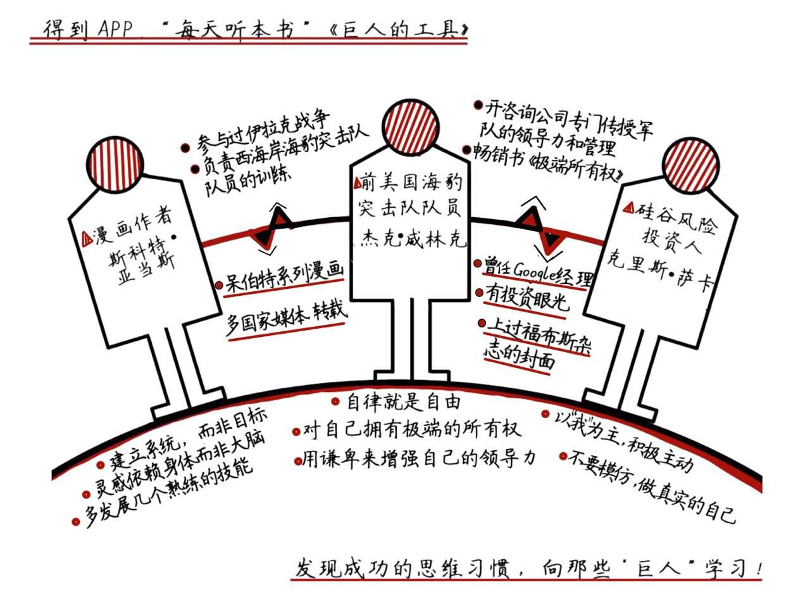

### 巨人的工具
  
  
**关于作者**  

蒂姆·费里斯, 1977年出生的美国畅销书作家，著有《每周工作4小时》、《4小时锻炼身体》、《4小时大厨》。他有一个特别受欢迎的博客，还是一个连续创业者和天使投资人。  

**关于本书**  

从书名就能看出来，这本书讲的是牛人们的方法论。这本书非常新，2016年12月份才出版，一出版就被各种好评。这本书主要告诉你，那些牛到天际的真牛人，到底是怎么思考问题、怎么工作生活的。  

**核心内容**  

本书会给你带来三个收获：  
第一，对牛人思维方式里的共性形成直观的认知；  
第二，从牛人方法论里学到科学的决策方法；  
第三，让自己找到把生活变高效的捷径。  

前言  

你好，欢迎每天听本书。今天分享给你的书叫《巨人的工具》，它还有一个很长的副标题：亿万富翁、偶像和世界级表演者的战术、习惯和日常。从书名就能看出来，这本书讲的是牛人们的方法论的。这本书是2016年12月份出版，一出版就被各种好评。这本书的作者是蒂姆·费里斯，费里斯是好多本畅销书的作者，还是一个连续创业者和天使投资人。
我们推荐这本书给你，一是因为这本书非常实用，它直截了当地告诉你，牛人们用什么方法工作、生活，这能启发你活得更有智慧；二是因为这本书是得到专栏作者万维钢老师花大力气解读过，万老师推荐必属精品。
本书的作者费里斯访问过大概一两百位名人，这些人都是各个领域的一线大牛，然后他把访谈内容编排在一起，就成了这本书。不过呢，这本书700多页，里面的人物实在太多，我们只能精选几位最有启发的给到你。
第一个是漫画作者斯科特·亚当斯，他告诉你，不要去追求实现一个什么具体的“目标”，而要发展一个“系统”；第二个是前美国海豹突击队队员杰克·威林克，他告诉你，真正的自由是自律，是你要对你的世界有极端所有权；第三个是硅谷风险投资人克里斯·萨卡，他告诉你，生活中的挑战应接不暇，你应该学会优先应对进攻型挑战。

第一部分  

我们先看第一个人物，漫画作者斯科特·亚当斯，他的呆伯特系列漫画，今天同时在65个国家，使用25种语言，超过两千家报纸转载。亚当斯原本是个坐办公室的白领文员，刚开始画呆伯特漫画的时候因为要上班，必须每天早上四点起来画。他是怎么坚持下来，取得今天这个成就的呢？亚当斯分享的最有价值的经验，大概是这么三条。  

第一条，要为自己建立一个系统，而不是定一个目标 亚当斯当年一边工作一边业余画画和写作，这些给他带来的物质回报非常少，大概只相当于工资收入的5%，对生活几乎没有任何影响。当时他女朋友问他为什么要干这件事？亚当斯答不上来。亚当斯现在总结，他做的这个事情，不是为了完成一个什么具体的“目标”，而是为了发展一个“系统”。所谓“目标”，你做这件事就是为了做好这件事，成功了就有回报，失败了就算白干。  
而亚当斯所谓的“系统”，则是一个连续变化的东西，或者是一项技能，或者是一个关系，比如夫妻关系。为了这个系统，你可以做各种项目，你可以要求自己养成什么习惯，你要的不是某个具体事件的成败，而是发展这个系统。
亚当斯的博客写作，就是一个系统。具体哪篇文章能不能获得收入，有多少读者阅读，都不重要，重要的是能不能让这个系统不断地发展。他写博客没有任何具体的目标，这恰恰是系统的特征。怎么发展系统呢？亚当斯做了两个方面的事情。第一是要定期写，不能三天打鱼两天晒网。  

第二，要把博客当作一个研发平台，在上面做各种写作技术的测试。比如亚当斯测试了不同类型的话题，看哪个话题受读者欢迎。他还测试自己用各种不同的口吻写作，比如愤怒的口吻、幽默的口吻、批评的口吻等等，看哪一种感觉更受读者欢迎。时间长了，博客越写越多，亚当斯的写作系统就成长起来了。后来华尔街日报听说了他的博客，就邀请他开个专栏。亚当斯一上手，专栏马上大受欢迎！这是因为此时的亚当斯已经拥有了一个成熟的写作系统，他完全知道文章应该怎么写。亚当斯说，他写博客的时候，只知道这个博客壮大起来就会有各种可能性，但是他完全没有任何具体的目标。他并没有事先规划好，到什么时候去华尔街日报开专栏。你看，系统有了，一切都自然发生。  
亚当斯的第二条经验是，灵感更依赖身体，而不是大脑。如果你的写作技术已经比较成熟了，你最关心的就不是“怎么写”，而是“写什么”。亚当斯的专栏要保持高频率的更新，就必须要有大量的想法做后盾。那么他的想法都是从哪儿来的呢？ 为了获得新想法，亚当斯每天早上起来之后的流程完全固定，连吃的早餐每天都完全一样。他这个套路的精髓是先清空大脑，再用新信息灌满大脑。清空大脑，就是早餐之后把昨天的一切问题抛到脑后，把整个大脑“腾出来”接收新信息。然后他就打开电脑、看新闻、读文章，了解现在世界都在发生什么，他必须从这些日常的新信息里获得下一幅漫画或者专栏文章的素材和灵感。  
现在关键点来了。浏览信息的过程中，你怎么判断哪条信息值得作为素材呢？亚当斯说，你不应该听从大脑的判断，你应该听从身体的判断，因为大脑容易想太多，而身体则是自然反应。亚当斯总是观察他自己的身体的反应，看到这条素材，是不是不由自主地笑了？肾上腺素激增？产生强烈的情感波动？那就说明这个东西一定是个好素材。如果你的身体对什么信息作出强烈反应，那么别人大概也会关心这个东西。  

第三条经验是，在自己身上多发展几个熟练的技能。 亚当斯说，如果你想取得出类拔萃的成就，你大概有两个选择。  
第一个选择是你把自己的某个技能练到全世界最好。这个非常困难，极少人能做到；第二个选择是，你可以选择两项技能，把每一项技能都练到世界前25%的水平，这就比较容易。同时拥有两个能排在前25%的技能的人，其实是很少的，而如果你能把这两个技能结合起来去做一件事，你就可能取得了不起的成就。比如亚当斯自己。他不是世界上画画技能最好的，但是他的画画技能能达到前25%的水平。他写笑话的技能也不是全世界最好的，但是他写笑话的技能也能达到前25%的水平。现在他把这两项技能结合到一起，画“呆伯特漫画”，能做到这一点的人就太少了。  
而亚当斯其实还有第三个技能，那就是他此前坐办公室坐了很多年，他特别懂办公室政治！办公室政治恰恰就是呆伯特漫画的主题，这就是三个厉害的技能放在一个人身上产生的化学反应。所以亚当斯给年轻人的建议是，不管你真正喜欢的领域是什么，你要努力在这个领域练到前25%。然后你最好再加一两个领域。如果你不知道该加什么领域，亚当斯建议你练演讲。  
亚当斯说，演讲这个东西，只要是个人，愿意苦练，就一定能练好。如果你是个 Top 25% 的程序员，你们公司有很多也是Top 25%的程序员，但是你同时还是一个 Top 25% 的演讲者，那你天然就是其他那些程序员的领导啊。对于这个方法，这本书里说，有一个著名的作家马克·安德森也有类似的建议，他说年轻人在大学最好能拿到两个不同学科的学位，这两个学科距离越远越好。比如工程+MBA、法学+MBA，或者物理学+经济学。  

第二部分

以上就是我们要讲的第一个人物，斯科特·亚当斯，接下来我们讲第二个人物，曾经担任过美国海军海豹突击队指挥官的杰克·威林克，他的心得是，真正的自由是自律，是你要对你的世界有极端所有权。  
这位威林克在海豹突击队服役二十年，参与过伊拉克战争，回来以后负责西海岸所有海豹突击队队员的训练，退伍以后跟人合开了一家咨询公司，专门向商界传授军队的领导力和管理经验。2015年，威林克还出了一本书，叫《极端所有权：海豹突击队的领导方法与制胜策略》，这本书曾经在纽约时报畅销书排行榜名列第一。  
威林克的方法论主要有三条经验。  

第一条是，自律就是自由。咱们得到的用户都是“战士”，每天工作学习都好像战斗一样，都在想方设法提高自己，取得胜利。这种精神当然厉害，不过这里说的“战士”和“战斗”主要还是一种比喻。毕竟你的工作和学习都见不着血，就算偶尔失败了，也不至于有人就得牺牲生命。我们有时候自己给自己增加压力，搞个什么演习之类，其实多数情况下最高目标也就是让领导满意而已。那如果一个人真的上过战场，见过血，面对过真正的敌人，自己一个错误决定就可能导致战友牺牲，这样的人，是一种什么气质呢？  

有一个例子可以回答这个问题。为了这本书的访谈，作者费里斯特意把威林克请到自己家里，威林克还住了一晚。第二天早上八点，费里斯的女朋友把费里斯叫醒，说威林克好像五个小时之前就起床了，一直在看书。她作为女主人，都不知道该怎么招待。其实五个小时可能也不至于，威林克的正常习惯是每天早上4:45起床做事。他早就退役了，但是保留了特种部队的纪律，还能连续做76个俯卧撑。费里斯就问威林克为什么非得早起，威林克说早起能让他获得一种在心理上战胜了敌人的感觉。  

威林克总觉得世界上的某个地方有个敌人，一手拿着冲锋枪一手拿着手榴弹，等着跟他交锋。他已经不在军队，将来不会再上战场了，但是他总觉得有一天还会面对敌人。每天早上一睡醒，他就问自己，我现在做什么，才能为那个时刻做好准备？然后他就起来了。威林克这个精神，感染了很多美国人。现在Twitter上就有人组成了一个“4:45起床俱乐部”。早起也是自律的体现。威林克的座右铭是“自律=自由”，你为了获得真正的自由，就非得给自己设定一些限制。我们平时所谓的自由，比如说想要什么有什么，想做什么做什么，这个其实有两个弊端，不是真正的自由。  

一个弊端是“选择悖论”。你面临的选项太多，就容易挑花眼，根本不知道选什么好，幸福度反而下降了。还有一个弊端是“决策疲劳”。有个理论说我们每一次做决定都会消耗一点意志力，选来选去什么都没干就已经身心俱疲。这里我想补充一句，现代社会某些人得抑郁症，可能就是因为太自由了。表面上看什么都可以做，实际上做什么都没意思，也没意义。这样的自由就如同开了作弊码打电子游戏，玩一会儿之后面对的就是无尽的空虚。可是如果你是个特别自律的人，每天面对各种限制，有各种固定流程，你每时每刻都知道自己应该干什么，你反而获得了一种自主的感觉。所谓“真正的自由”，也就是财务自由、时间自由、免于疾病和贫困的自由，为了达到这样的目标你必须自律才行，这个道理很明白。  

威林克的第二条经验是，要对自己拥有极端的所有权。海豹突击队在重大行动之前，负责整个海豹突击队的海军准将会召集所有分队指挥官开一个会，指挥官们就抓住这个机会赶紧向上级提要求。比如，有的指挥官说我们跟直升机的合练还不够，请求多派几架直升机。有的指挥官说我们配发的靴子适合炎热天气，这次任务估计天气比较冷，希望能发新靴子。有的指挥官说我们在沙漠行军，士兵跟外界失去联络很难受，最好能给WiFi信号。准将一一答应了这些要求。 

威林克引以为荣的一个时刻，是准将问到他这里，他的回答是：“我们很好，长官。”他没有提任何要求。威林克说，这个逻辑是这样的。我对我的世界，有极端的所有权。如果我的队伍有问题，我自己就会解决，我不会等到这个时候向上级抱怨。反过来说，如果哪一天我真的跟上级说，“老板，我需要这个”，那我马上就能得到我需要的，因为上级明白，凡是我提出的要求，一定是我真的需要。威林克说，人们总爱抱怨上级没有给自己足够的支持，其实那根本就是你自己的错误。你没有好好教育你的上级，你没有正确影响你的上级，你没有让他理解你为什么需要这个支持。自己必须负责任，这就是极端的所有权。  

威林克的第三条经验是，要用谦卑来增强自己的领导力。怎样才是一个好的指挥官？威林克的答案是“谦卑”。威林克回到本土负责整个西海岸海豹突击队的训练，他故意用超高难度的环境和任务压迫部队，一直到把所有队伍都压垮为止，其中一项重点考察就是看各个小队的指挥官怎么反应，不行的就淘汰。威林克发现，最后被淘汰的指挥官，几乎没有人是因为军事技术或者体能不行，而都是领导力不行。其中最缺乏的一个素质，就是谦卑。这里“谦卑”并不是说对领导毕恭毕敬的意思，而是你这个人听得进去别人的话，有开放的头脑，能时刻学习。  

训练任务是故意让所有队伍都失败。有谦卑素质的指挥官回来，首先把责任归于自己。是我没控制好，我输了，咱们能不能复盘一下，看看我哪个地方做得不对。然后你给他指出不足，他马上记在笔记本上。  

而对比之下，傲慢自大的指挥官回来先指责别人，反正自己没错，他好像什么都知道，其实他连诚实的自我评估都做不到。  

那威林克是怎么自我评估的呢？他以一个第三人称的视角，旁观自己。你正在做这件事，但是你能够时不时地跳出自己的身体，去观察你自己：我是不是生气了？我是不是太感情用事了？我是不是反应过度了？这个其实就有点像咱们中国人说的“当局者迷旁观者清”，这等于是自己给自己提供即时反馈。做到这一点非常困难，这要求你在即使投入全部身心的情况下，仍然能在心里保持一个冷静的声音，给自己提个醒，这是谦卑的最高境界。  

第三部分  

以上就是第二个人物，前海豹突击队指挥官威林克。接下来我们来讲第三个人物，克里斯·萨卡。萨卡可能是硅谷最成功的风险投资人之一，据说身价超过十亿美元。  

萨卡曾经在 Google 担任过部门的经理，出来搞风险投资以后有过多个神来之笔，像 Twitter 、 Uber、Instagram 、Kickstarter 这些现在如雷贯耳的公司，萨卡都是在它们创业早期就投资了。他还上过福布斯杂志的封面。费里斯这本书里的萨卡，是个有点性格的人。比如作为一个风险投资者，人们都把他当硅谷的人，毕竟他投的大部分公司都在硅谷，但是萨卡并不住硅谷，他住在加州一个山区里。  

萨卡为什么不住在浪潮中心呢？因为他是一个进攻的人。萨卡说，你在生活中面对的各种挑战可以分为两类。一类挑战是“防守”，也就是那些别人给你的挑战。别人给你任务，你想方设法完成，做成了也很有成就感，但是主动权是在别人手里。另外一类挑战是“进攻”，是你做自己想做的事情，主动权在自己手里。比如你的电子邮箱，其实就是你的防守任务列表。每一封邮件都是别人想让你干的事儿，如果你一直被邮箱左右，你就一直在防守。萨卡想进攻。所以他从2007年就搬离了距离硅谷30分钟车程的旧金山，跑到山里面去居住。萨卡不想再没完没了地见各种人，开各种会了。他在山里可以集中精力做一些自己想做的事情，学习新东西，建立一些真正有价值的长期关系。  

他住的地方正好是个滑雪胜地，景色很好。他就经常在周末邀请各路商业伙伴来家里玩，别人也愿意来，结果这样的关系显然更深入。这种长期的个人朋友关系，是萨卡成功投资 Twitter 和 Uber 这些公司的关键。所以我们看，风险投资人肯定要认识很多很多人，而现在萨卡的特点是他已经不再被动地见很多人，而是主动地、有选择地跟一些人建立更高水平的关系。  

这里面的关键词，是“主动”。所谓进攻，就是要以我为主，积极主动。实际上萨卡早期也是这样。他知道风险投资人需要很多知识，对各行各业的情况都得有点了解，可是如果你在一个公司有份正式工作，你的工作能够给你提供的视野往往非常有限，那你就必须主动出击。  

当年萨卡的做法就是不论哪有重要会议，不论人家是否邀请了他，他都想方设法去听一下。在 Google 的时候，各种高层的会议，甚至创始人之间的会议，萨卡也去参加。他去开会别人根本没请他，有时候人不好意思说他，有时候也会有人问他来干什么，这时候萨卡就说，“我是来帮你们做会议记录的。”然后他真的会把自己记的笔记发给与会者。  

你可能会问，像这样主动出击需要极高的情商，萨卡的情商是怎么练出来的呢？这本书说了萨卡很多小时候的故事。其实，美国现在阶层也挺固化，连互联网行业这个全新行业的创业者，通常也不是出自中等以下的家庭。萨卡的家庭就有点不一般，他的父母是有一定能力的人。美国学校的暑假长达两个半月，穷人家小孩就在家里瞎玩，有条件人家的小孩则可以参加各种培训班和夏令营。而萨卡家的规矩，是每年暑假出去实习。  

实习分两个阶段，萨卡称之为“甜酸暑假”。先说“甜”的部分。萨卡的父亲有个朋友，也是萨卡的教父，这位教父有个儿子，算是萨卡的“教兄”吧。萨卡这位教兄的职业，是帮着利益集团在华盛顿游说国会议员。12岁那年，萨卡的实习生工作就是给教兄当小跟班，去参加游说。而且萨卡在其中起到了一个相当严肃的作用。在游说每个政客之前，萨卡会先跟他教兄梳理一下这次游说要达到的各种条款，萨卡会把计划的内容浓缩到一张纸上，帮教兄理清思路。然后他跟着教兄去参加和政客的会面，他教兄跟政客谈，他就在旁边看。  

12岁的萨卡，就已经见过华盛顿那帮议员的各种嘴脸。萨卡说这种实习至少给了他三个收获：第一是获得了很多见识；第二是建立了强大的自信心；而更重要的第三条，通过总结谈话要点，他掌握了很强的讲故事能力。而暑假里“酸”的部分是萨卡回到自己家，父亲安排他去一个建筑队打杂。建筑队的老板是他父亲的朋友，他父亲要求老板把最脏最累的活儿安排给萨卡，比如把粪肥洒到别人家的院子里。如果萨卡干得不好，工友们还会对他打骂！也许这种吃苦的工作能磨炼意志品质吧。不过萨卡调侃，他父亲安排这两份实习可能还有一个警告的意思，如果你拿不到华盛顿说客这样高端的工作，那你就只能做建筑队那种工作了。靠这些不同的人生体验，成就了萨卡超凡脱俗的情商。  

而且，我们知道有些硅谷名人爱穿标志性的衣服，比如乔布斯每次开发布会都是一件黑色套头衫，扎克伯格总爱穿一件T恤衫。萨卡的标志性服装是一件绣花牛仔服。为啥非得这样呢？萨卡说他有一次出去做演讲，在机场很随性地买了件衣服，演讲的时候穿着反响很好。于是他回来就把这家店里同款衣服的一半库存都买了，从此一有正式场合就穿这件。这件衣服给了媒体一个很强的辨识度，这是在不伤害自己的情况下增加曝光的最好方法，何乐而不为呢？  

萨卡对年轻人的忠告是，任何时候都要真诚，不要模仿任何人，永远做最真实的自己—而且你不必为此道歉。如果你的真实自我是一个很怪异的人，那你就做这样一个很怪异的人。其实这个说法在《巨人的工具》这本书里提到的另一个人物格林·贝克也提到过。格林·贝克是现在美国当红的节目主持人，他有一次在电台节目里没忍住，暴露了自己很隐私的事情，以为职业生涯结束了，没想到听众反而很欢迎。这个逻辑是现代社会里太多人说话都是按照事先写好的稿子说，越是这样人们就越欢迎真诚的声音。跟别人一样非常无趣，真诚的自我表达反而可能有市场。如果你真的在某些方面有特殊之处，它可能还是你的卖点。  

萨卡给的最后一个忠告是，一定要善于讲故事。风险投资人做决策，其实并不是依靠理性分析你的数字和图表，而是在听你的故事。如果他能被你的故事打动，他就会投资你的项目。如果你发现一个投资人在纠结地翻来覆去看你的数据，他其实不是在那里做计算，而是他想从这些数据里面去找到相信你这个故事的理由。  

总结  

到这里，这本《巨人的工具》就讲完了，我们再回顾一下。这本书里三个优秀的大人物告诉我们，不要去追求实现一个什么具体的“目标”，而要发展一个“系统”；真正的自由是自律，是你要对你的世界有极端所有权；生活中的挑战应接不暇，你应该学会优先应对进攻型挑战。  

撰稿：万维钢  

脑图：摩西  

转述：怀沙  