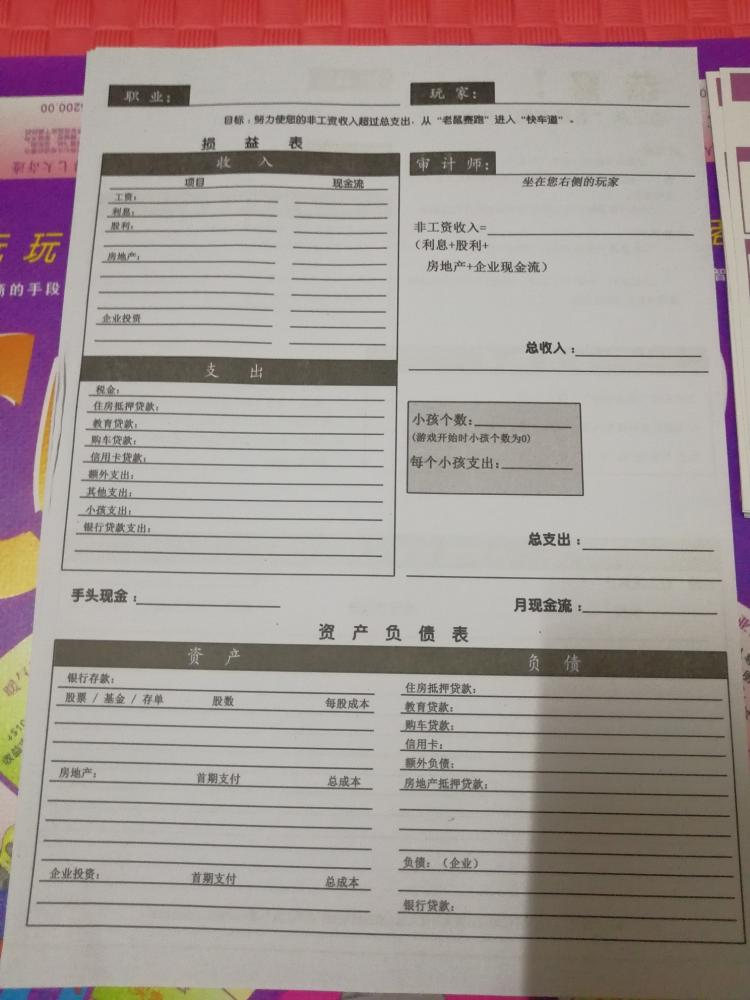

<ul>
<li>
风险无处不在，所以别想着远离风险，而是要学会管控风险。
</li>
<li>
要想拥有财富，就要让自己配得上它。
</li>
<li>
常识性才是最贵的。
</li>
<li>
失败不是成功之母，成功才是成功之母。
</li>
<li>
成功反义词不是失败，而是平庸。
</li>
<li>
从学校毕业后，个人财务报表（资产负债表，损益表/利润表）就是你的成绩单。
</li>
</ul>

<table>
<thead class="trbgcolor">
<th colspan="2">损益表</th>
</thead>
<tr class="trbgcolor">
<th style="width:50%;">收入</th>
<th style="width:50%;">现金流</th>
</tr>
<tr>
<td>工资收入</td>
<td>7100</td>
</tr>
<tr>
<td>合计</td>
<td>7100</td>
</tr>
<tr class="trbgcolor">
<th>支出</th>
<th>现金流</th>
</tr>
<tr>
<td>午饭</td>
<td>7100</td>
</tr>
<tr>
<td>合计</td>
<td>7100</td>
</tr>
<tr>
<td colspan="2" class="fontbold">收入总计</td>
</tr>
<tr>
<td class="fontbold">被动收入=</td>
<td ></td>
</tr>
<tr>
<td colspan="2" class="fontbold">被动收入=利息+分红+房地产+公司的现金流</td>
</tr>
<tr>
<td class="fontbold">月现金流</td>
<td ></td>
</tr>
</table>

 

<table id="assets">
<thead>
<th colspan="5">资产负债表</th>
</thead>
<tr>
<th colspan="3">资产</th>
<th colspan="2">负债</th>
</tr>
<tr>
<td>储蓄</td>
<td colspan="2"></td>

<td>信用卡</td>
<td>金额</td>
</tr>
<tr>
<td>基金</td>
<td>数量</td>
<td>成本</td>
<td></td>
<td></td>
</tr>
<tr>
<td>-</td>
<td>-</td>
<td>-</td>
<td>-</td>
<td>-</td>
</tr>
<tr>
<td>房地产</td>
<td>首付</td>
<td>成本</td>
<td></td>
<td></td>
</tr>
<tr>
<td>-</td>
<td>-</td>
<td>-</td>
<td>-</td>
<td>-</td>
</tr>
<tr>
<td>公司</td>
<td>首期</td>
<td>成本</td>
<td></td>
<td></td>
</tr>
<tr>
<td>-</td>
<td>-</td>
<td>-</td>
<td>-</td>
<td>-</td>
</tr>
</table>
  

  
累计收益=持有基金的浮动盈亏+已赎回基金的总盈亏+未付收益

持仓收益 = 当前最新市值 – 持仓成本

