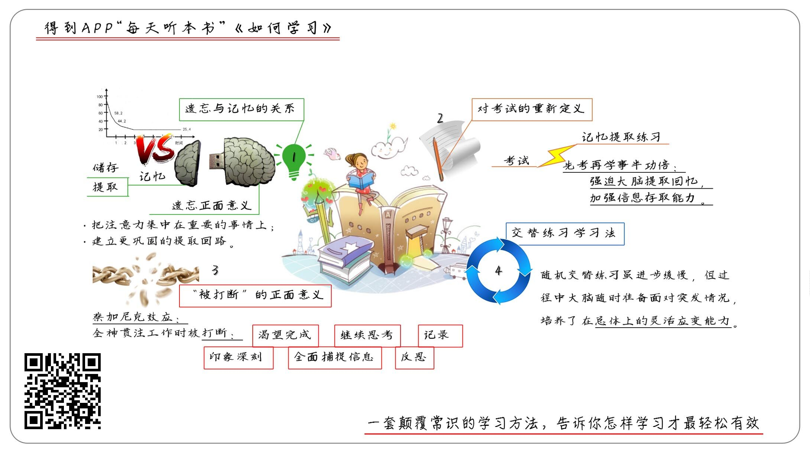

### 如何学习 pro版

**关于作者**  

本尼迪克特·凯里，《纽约时报》顶级科学记者。投身新闻事业的30年中，持续追踪报道了脑科学及认知心理学研究前沿，曾采访过许多著名专家学者。他对学习科学的研究很感兴趣，一边将这一领域最新研究成果变为权威性报道，一边在生活中不断实践，总结出一套颠覆传统的高效学习法。  

**关于本书**  

本书汇集了神经科学、脑科学和认知心理学最前沿的研究成果，从大脑的学习机制讲起，一路探寻记忆的真相、环境的影响、灵感和顿悟的产生以及潜意识的奥秘，提炼出了一套颠覆常识的高效学习方法，告诉你何时学、在哪学、怎么学才能有效、轻松、不费力。  

**核心内容**  

学习这件事情真的不是全靠天分，而是有一套系统的方法论，而这些方法论几乎颠覆了我们惯用的方法。通过解读，让你掌握四个高效的学习武器。    

前言  

你好，我是湛庐文化创始人韩焱，欢迎每天听本书。湛庐文化是一个优秀的阅读服务品牌，我们一直在努力地传播最先进最有价值的知识、思想。你在得到听到看到的很多书，包括各位专栏大咖讲解的书，大量都是湛庐文化出品的。我已经在得到为你解读湛庐文化策划出版的许多优秀作品，我还会和你分享这些好书的出版故事。今天我要为你解读这本书是《如何学习》。  

下面，我就从以下几个方面，为你介绍这些颠覆常识的学习理念和具体方法：  
第一个方面，为什么说“遗忘是记忆的好帮手”？  
第二个方面，为什么说“先考试再学习”的效果更好？  
第三个方面，为什么“被打断”反而能帮你更高效地完成任务？  
第四个方面，为什么要放弃“刻意练习”的学习方法？  

第一部分  

我先来说说：为什么说“遗忘是记忆的好帮手”。在大多数人眼中，遗忘看起来都像是学习的敌人，我们恨不得希望学到的知识，都能像乘法口诀一样倒背如流。在过去的研究中，著名的心理学家艾宾浩斯曾提出过记忆遗忘曲线，告诉我们说，已学的东西如果不能再次运用，就会在记忆中逐渐消退乃至永久消失。这某种程度上造成了我们对“遗忘”的恐惧和焦虑，然而，在本书当中，作者指出，适当的“忘记”反而可以更好地提高记忆。这主要是由记忆的两个能力造成的，它们分别是储存能力和提取能力。  

储存能力呢，指的就是你学到的东西在大脑中储存的有多坚实。储存能力只会越变越强，永远不会减弱。从生物学角度来看，大脑能储存的东西可以供300万套电视节目同时播放，这个量级的空间足以储存你从出生到走向坟墓这漫长一生中每一秒的所见所闻。  

所谓提取能力，指的是某项信息被提取到意识中的难易程度，也就是说，你光把知识存在脑子里还不行，需要用的时候，还得能马上拿出来。和储存能力比起来，你能提取的记忆容量很小。你能感觉到自己记住的东西，其实只是那些你能提取出来的东西。用得多的就被强化了，也就是说，越用记得越牢。那些总是用不到的，就得不到强化，也就越难提取出来了,被你认为是遗忘的记忆。相比于储存能力，人的记忆提取能力往往很不靠谱，它会受到当下环境和心境的影响。  

这也是著名的“记忆失用理论”。它彻底打破了人们对“遗忘”的认知，指明了遗忘的两大正面意义。遗忘不仅可以承担着“垃圾信息过滤器”的功能，在不同环境中，遗忘还能帮你的大脑发挥一种类似肌肉锻炼的作用，先损耗，后增长。虽然你总会“遗忘”一些内容，特别是当你经历一段时间后，经历一番困难重新回忆起这些记忆后，大脑会建立一个更稳固的记忆回路，让下一次提取记忆的速度更快。 

正因为遗忘的这两大积极作用，作者把这种遗忘到学习的过程，重新定义为更积极的遗忘式学习。我也希望你能更积极地去面对遗忘带来的困扰，尤其当你转换新工作，或者学习新知识遇到障碍的时候。要知道，初期的遗忘并不是因为你不努力、不专注，也不是你本身记忆力不好，相反，这证明你的大脑正在以恰当的方式工作着，这是每个人都必须经历的过程，只有这样，你才能更深刻地掌握知识和技能。  

我来给你总结下这一段的内容。过去，我们认为，遗忘是记忆的敌人，知识只会随着时间不断流逝。这本书中却提出，遗忘其实是记忆的朋友，“记忆失用”理论认为，记忆包含储存能力和提取能力两大功能。并向我们解释了遗忘的两大正面意义：遗忘就像一个“垃圾信息过滤器”，让你把注意力集中在重要的事情上。其次，遗忘还帮你的大脑发挥一种类似肌肉锻炼的作用，在你回想起已经遗忘的记忆后，这些记忆将建立更巩固的提取回路。  

第二部分  

说完了第一部分，接下来我为你说说，为什么说“先考试再学习”的效果更好。说到考试的作用，大多数人都会想到两个方面：一个是衡量，另一个是选拔。也就是说，我们会通过考试来衡量一个人的能力，通过考试来选拔我们想要的人才。因此，提到考试就会给人带来一种压力感。然而，作者提出，考试其实是一种特别高效的学习方法，提前考试，能让你学习和工作的效率事半功倍。  

为什么考试会有如此神奇的魔力呢？考试的本质就是强迫你的大脑，从记忆中提取已经学过的知识或技能，这要求你付出的努力远比直接重读一遍要多得多。更重要的是，记忆被提取的时候还会有额外的附加作用。心理学家勒迪革指出，把信息从脑海里“提取”出的过程中，这些信息还会被复制一份再储存起来，也会在神经网络中增加新的信息联结点。这样一来，这份额外的努力就加强了这些信息的储存和提取能力。所以说，心理学家把“考试”称作是“记忆提取练习”，它会让你的知识和技能掌握得更加牢固。  

按照这个理论，像背诵、做测试题、写作、演讲等“有提取功能”的“提取式练习方法”，都能跟考试起到类似的作用，是帮助你提升知识和技能的掌握速度。作者将这一类方法称为“先考试后学习”法。同时呢，他在书中也列举了这个方法的应用场景，无论你是在学习中，还是工作中用到这些技巧，都能让你的自我提升时事半功倍。比如说，在阅读一本自己读不进去的书的时候，怎样克服“走神”的毛病呢？那就是先给自己做一套测试题，当然了，你根本不必在意测试的成绩，测试的目的是让你带着问题去阅读，这样，大脑就会主动捕捉那些重要的信息，并建立更强的储存和提取回路，让你觉得知识像是被主动“赶进”你脑海的。 

正是因为这个理论，湛庐文化的几乎所有的图书，都会在开始部分先设计几道测试题，来帮助你快速进入阅读状态。如果你亲自阅读《如何学习》这本书，你会发现，我们的编辑老师甚至在每个章节前都设计了自测题。  

除了阅读，这个原理还可以应用在工作中。比如开会前，你可以先罗列一份会议需要解决的问题清单，这样就可以避免会中讨论无关的话题，每个人的思路都能围绕这份清单，共同去寻找答案，让会议更高效。  

以上就是第二部分主要内容，我来总结一下。在这一部分呢，作者纠正了我们对考试的认知，重新把考试定义为“记忆提取练习”，这种学习方法不同常规，但却是非常高效的。考试可以强迫你的大脑，从记忆中重新提取已学过的知识或技能，大脑在经历费劲的回忆过程后，会加强这些信息的储存和提取能力，这就是考试提升能力的神奇奥秘。在学习新知识，开会前，你都可以用这个方法，帮你自己或者用户更好地提升学习效率。  

第三部分  

说完了第一部分，接下来我为你说说，为什么说“先考试再学习”的效果更好。说到考试的作用，大多数人都会想到两个方面：一个是衡量，另一个是选拔。也就是说，我们会通过考试来衡量一个人的能力，通过考试来选拔我们想要的人才。因此，提到考试就会给人带来一种压力感。然而，作者提出，考试其实是一种特别高效的学习方法，提前考试，能让你学习和工作的效率事半功倍。  

为什么考试会有如此神奇的魔力呢？考试的本质就是强迫你的大脑，从记忆中提取已经学过的知识或技能，这要求你付出的努力远比直接重读一遍要多得多。更重要的是，记忆被提取的时候还会有额外的附加作用。心理学家勒迪革指出，把信息从脑海里“提取”出的过程中，这些信息还会被复制一份再储存起来，也会在神经网络中增加新的信息联结点。这样一来，这份额外的努力就加强了这些信息的储存和提取能力。所以说，心理学家把“考试”称作是“记忆提取练习”，它会让你的知识和技能掌握得更加牢固。  

按照这个理论，像背诵、做测试题、写作、演讲等“有提取功能”的“提取式练习方法”，都能跟考试起到类似的作用，是帮助你提升知识和技能的掌握速度。作者将这一类方法称为“先考试后学习”法。同时呢，他在书中也列举了这个方法的应用场景，无论你是在学习中，还是工作中用到这些技巧，都能让你的自我提升时事半功倍。比如说，在阅读一本自己读不进去的书的时候，怎样克服“走神”的毛病呢？那就是先给自己做一套测试题，当然了，你根本不必在意测试的成绩，测试的目的是让你带着问题去阅读，这样，大脑就会主动捕捉那些重要的信息，并建立更强的储存和提取回路，让你觉得知识像是被主动“赶进”你脑海的。  

正是因为这个理论，湛庐文化的几乎所有的图书，都会在开始部分先设计几道测试题，来帮助你快速进入阅读状态。如果你亲自阅读《如何学习》这本书，你会发现，我们的编辑老师甚至在每个章节前都设计了自测题。 

除了阅读，这个原理还可以应用在工作中。比如开会前，你可以先罗列一份会议需要解决的问题清单，这样就可以避免会中讨论无关的话题，每个人的思路都能围绕这份清单，共同去寻找答案，让会议更高效。  

以上就是第二部分主要内容，我来总结一下。在这一部分呢，作者纠正了我们对考试的认知，重新把考试定义为“记忆提取练习”，这种学习方法不同常规，但却是非常高效的。考试可以强迫你的大脑，从记忆中重新提取已学过的知识或技能，大脑在经历费劲的回忆过程后，会加强这些信息的储存和提取能力，这就是考试提升能力的神奇奥秘。在学习新知识，开会前，你都可以用这个方法，帮你自己或者用户更好地提升学习效率。  

第四部分  

说完了第一部分，接下来我为你说说，为什么说“先考试再学习”的效果更好。说到考试的作用，大多数人都会想到两个方面：一个是衡量，另一个是选拔。也就是说，我们会通过考试来衡量一个人的能力，通过考试来选拔我们想要的人才。因此，提到考试就会给人带来一种压力感。然而，作者提出，考试其实是一种特别高效的学习方法，提前考试，能让你学习和工作的效率事半功倍。  

为什么考试会有如此神奇的魔力呢？考试的本质就是强迫你的大脑，从记忆中提取已经学过的知识或技能，这要求你付出的努力远比直接重读一遍要多得多。更重要的是，记忆被提取的时候还会有额外的附加作用。心理学家勒迪革指出，把信息从脑海里“提取”出的过程中，这些信息还会被复制一份再储存起来，也会在神经网络中增加新的信息联结点。这样一来，这份额外的努力就加强了这些信息的储存和提取能力。所以说，心理学家把“考试”称作是“记忆提取练习”，它会让你的知识和技能掌握得更加牢固。  

按照这个理论，像背诵、做测试题、写作、演讲等“有提取功能”的“提取式练习方法”，都能跟考试起到类似的作用，是帮助你提升知识和技能的掌握速度。作者将这一类方法称为“先考试后学习”法。同时呢，他在书中也列举了这个方法的应用场景，无论你是在学习中，还是工作中用到这些技巧，都能让你的自我提升时事半功倍。比如说，在阅读一本自己读不进去的书的时候，怎样克服“走神”的毛病呢？那就是先给自己做一套测试题，当然了，你根本不必在意测试的成绩，测试的目的是让你带着问题去阅读，这样，大脑就会主动捕捉那些重要的信息，并建立更强的储存和提取回路，让你觉得知识像是被主动“赶进”你脑海的。  

正是因为这个理论，湛庐文化的几乎所有的图书，都会在开始部分先设计几道测试题，来帮助你快速进入阅读状态。如果你亲自阅读《如何学习》这本书，你会发现，我们的编辑老师甚至在每个章节前都设计了自测题。  

除了阅读，这个原理还可以应用在工作中。比如开会前，你可以先罗列一份会议需要解决的问题清单，这样就可以避免会中讨论无关的话题，每个人的思路都能围绕这份清单，共同去寻找答案，让会议更高效。  

以上就是第二部分主要内容，我来总结一下。在这一部分呢，作者纠正了我们对考试的认知，重新把考试定义为“记忆提取练习”，这种学习方法不同常规，但却是非常高效的。考试可以强迫你的大脑，从记忆中重新提取已学过的知识或技能，大脑在经历费劲的回忆过程后，会加强这些信息的储存和提取能力，这就是考试提升能力的神奇奥秘。在学习新知识，开会前，你都可以用这个方法，帮你自己或者用户更好地提升学习效率。  

总结  

以上就是我为你分享的《如何学习》这本书的主要内容。我们来简单回顾一下，我今天讲到的四个方面内容：  

第一点，我们讲到了，遗忘与记忆的关系。书中提到的“记忆失用”理论认为，记忆包含储存和提取两大功能。所以，遗忘就像是一台“垃圾信息过滤器”，让你把注意力集中在重要的事情上。其次，遗忘还能帮你的大脑发挥一种类似肌肉锻炼的作用，在你回想起已经遗忘的记忆后，这些记忆将建立更巩固的提取回路。  

第二点，我们讲到了对考试的重新定义：考试不仅是检测和选拔的工具，更是一种非常高效的学习方式。不同形式的考试目的都是强迫你的大脑，从记忆中重新提取已学过的知识或技能，大脑在经历费劲的回忆过程后，会加强这些信息的储存和提取能力，这就是考试提升能力的神奇奥秘。  

第三点，我们讲到了，学习和工作中“被打断”的正面意义。当你被打断之后，你的大脑并不会停止对问题的思考，反而会调动各种感知力捕捉相关的信息。最后，你只需要将这些信息记录并加以反思，就能形成更好的答案。  

最后一点，我们分享了交替练习学习法，它与刻意练习所提倡的重复训练相比，更能很好地适应真实场景。不论是掌握运动技巧，还是认知训练上，采用随机交替的练习方式，都能让你的大脑更好地做出面对意外挑战的准备，提高你的总体应变能力。  

撰稿、转述：韩焱  

脑图：刘艳